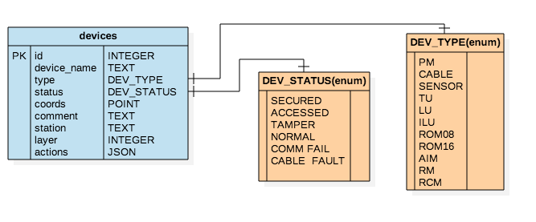
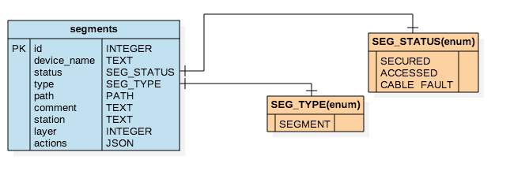
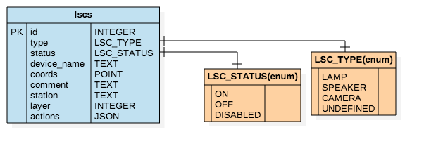
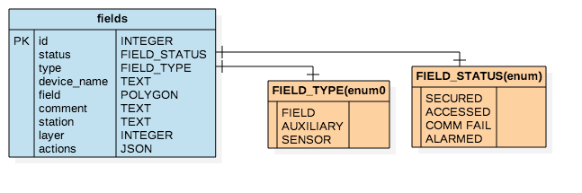
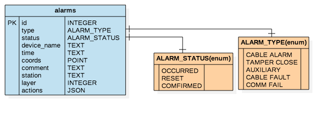
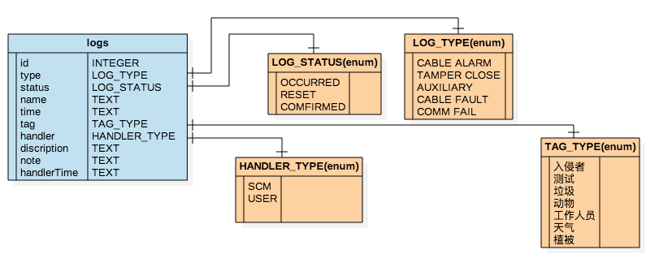
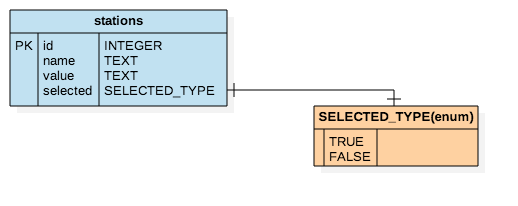
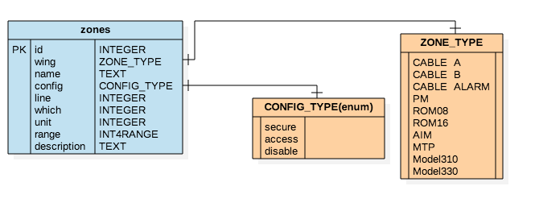
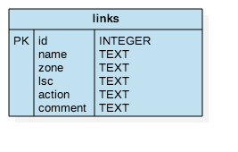

====
samlite数据模型简介
====

| 本文主要介绍软件samlite所涉及的数据模型。

工具
==========

**StartUML** ：是建模工具，可帮助开发者高效的完成数据模型建立。

**PostgreSql** ：是建立对象－关系型数据库，本项目使用该数据库为软件提供数据支持。

数据模型
==========

1. **device** 数据模型， ``DEV_STATUS, DEV_TYPE`` 为枚举类型， ``POINT`` 表示在一个平面上的点(x, y)。

2. **segment** 数据模型， ``SEG_STATUS, SEG_TYPE`` 为枚举类型， ``PATH`` 表示封闭路径(类似于多边形)((x1, y1),...)。

3. **lsc** 数据模型， ``LSC_STATUS, LSC_TYPE`` 为枚举类型。

4. **field** 数据模型， ``FIELD_STATUS, FIELD_TYPE`` 为枚举类型， ``POLYGON`` 表示多边形(类似于封闭路径)((x1, y1),...)。

5. **alarm** 数据模型， ``ALARM_STATUS, ALARM_TYPE`` 为枚举类型。

6. ***log***数据模型， ``LOG_STATUS, LOG_TYPE, TAG_TYPE`` 为枚举类型。

7. **station** 数据模型， ``VALUE_TYPE, NAME_TYPE, SELECTED_TYPE`` 为枚举类型。

8. **zone** 数据模型， ``ZONE_TYPE, CONFIG_TYPE`` 为枚举类型， ``INT4RANGE`` 表示范围为整数的类型。

9. **link** 数据模型。

